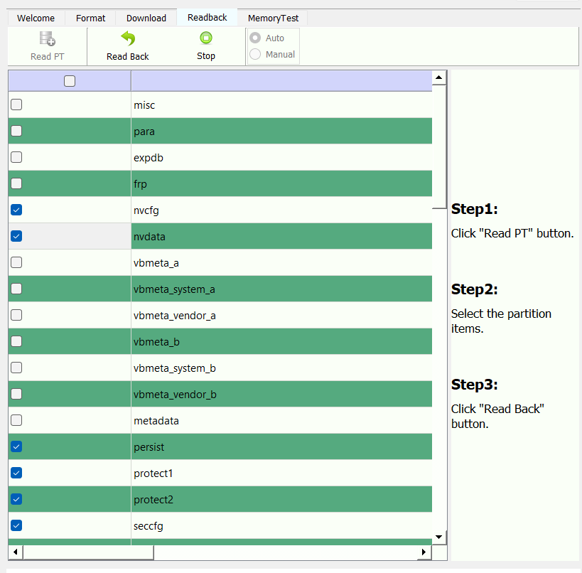
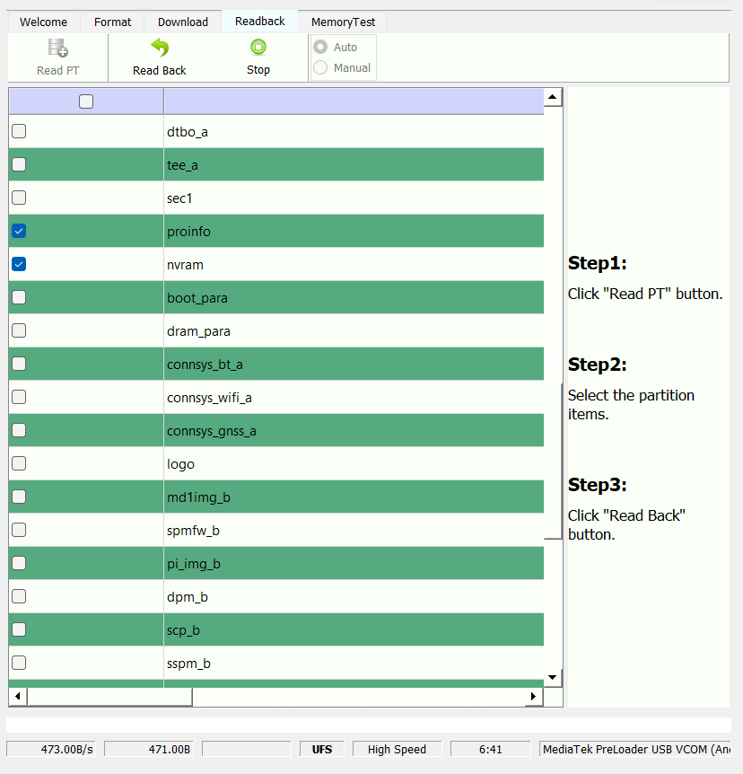

# Q25 50MP: install guide (v0.1.0-alpha, DRAFT)

> **Experimental. Read all of this before you start.**
> * This modifies two system partitions of your phone and turns off verified boot. A mistake can leave the phone unable to boot. Recovery is possible (see UNDO.md), but you can lose data.
> * Unlocking the bootloader **erases everything on the phone**.
> * Only for the **Zinwa Q25 on firmware `Q25_20.01.2026`** (package `OS-new-camera-0120-Q25-GMS`). The tools refuse to continue on anything else.
> * Tested so far on one phone. Use at your own risk. Not affiliated with Zinwa, Samsung, MediaTek or Nothing.
>
> Steps marked **[VERIFY]** come from the author's notes, not from a recorded command history, and have not been followed by anyone else yet.

## What you need
*Phones: this release is for the Q25 with the "new camera" module (Samsung JN1) on this firmware. To check: with USB debugging on, open the camera app for a few seconds, then run `cd C:\platform-tools` and `.\adb logcat -d | findstr /i "S5KJN1"`. A phone with the JN1 module prints lines containing `SensorName=SENSOR_DRVNAME_S5KJN1_MIPI_RAW`; if nothing is printed, do not continue.*

* A Q25 on firmware `Q25_20.01.2026`, charged to at least 60 %, and a good USB cable.
* A Windows 10/11 PC with about **25 GB free** disk space (no WSL or Linux needed).
* **Python 3.9 or newer** (`python --version`; install with `winget install Python.Python.3.12`).
* Android **platform-tools** (`adb` and `fastboot`), for example in `C:\platform-tools`, and the **Google USB driver** (the Zadig generic driver did not work with fastboot).
* The official firmware zip `OS-new-camera-0120-Q25-GMS.zip` from Zinwa's shared Google Drive folder (MassProduction, With-GMS): https://drive.google.com/drive/folders/1RlhjXInYh7t_ITkWS6fqKY4quZAAKmuT . Download **`OS-new-camera-0120-Q25-GMS.zip`** (about 2.6 GB; Google Drive shows it as 2.53 GB), **not** the `OTA-...` zip. The folder also contains `0120-changelog.txt`. This is the **With-GMS** build (with Google apps); other builds are not supported. It is the SP Flash Tool package and contains `super.img` (5.3 GB, the source of the stock images) and `vbmeta.img`. **Extract it into your Downloads folder** (right-click, Extract All, or 7-Zip). Check the zip first:
  `(Get-FileHash .\OS-new-camera-0120-Q25-GMS.zip -Algorithm SHA256).Hash` must be `1C00769031A31125CFC0A2C71FC68C4AFD36660F75344358B034466397DEF2E8`
* The release files from the **GitHub release page** (https://github.com/bellhopsw/q25-50mp/releases): `manifest.json`, `SHA256SUMS`, `vendor.qpatch`, `vendor_dlkm.qpatch`; and the scripts from the `tools` folder of the repository: `qpatch.py`, `apply_release.py`, `unsparse.py`, `imginfo.py`.
* `lpunpack.py`, downloaded in Part 0 (LGPL-3.0 licence).

## How to run the commands (read this first)
Everything is typed into **PowerShell** (not WSL, not cmd). Use **one** PowerShell window for the whole guide; the blocks tell you when to change folder (`cd`), and variables such as `$FW` stay available in that window.

* PowerShell does not run programs from the current folder unless you put `.\` in front of the name, so every phone command is written as **`.\adb ...`** and **`.\fastboot ...`**. They only work when PowerShell is *in* the platform-tools folder, which is why the blocks start with `cd C:\platform-tools`. (If yours is elsewhere, change that path.)
* The `python ...` commands run from `C:\q25`.
* Copy each block **completely** and paste it into PowerShell. Lines starting with `#` are comments.
* Test the phone connection once: with USB debugging on and the phone connected, `.\adb devices` should list it as `device` (accept the prompt on the phone if it asks).

### Where is `super.img`?
Inside the **official Zinwa firmware zip**. After you extract it, look for the subfolder **`SP1A.210812.016RELEASE-KEYS`**; it holds `super.img` (5.3 GB), `vbmeta.img`, `boot.img`, the scatter file and the other firmware parts. Part 4 finds it for you. You never flash `super.img`; it is only a source for the two stock images.

## Part 0: Set up your folder
Put **all** the downloaded release files and scripts together in `C:\q25\tools` (the scripts look for `manifest.json` and the `.qpatch` files next to themselves). Copy-paste this, then copy the other eight files into `C:\q25\tools`:
```
mkdir C:\q25\tools
mkdir C:\q25\work
Invoke-WebRequest https://raw.githubusercontent.com/unix3dgforce/lpunpack/master/lpunpack.py -OutFile C:\q25\tools\lpunpack.py
```
Then check:
```
Get-ChildItem C:\q25\tools
```
You must see exactly these nine: `manifest.json`, `SHA256SUMS`, `vendor.qpatch`, `vendor_dlkm.qpatch`, `qpatch.py`, `apply_release.py`, `unsparse.py`, `imginfo.py`, `lpunpack.py`. If any is missing, later commands fail with "can't open file". Then check that the downloads are intact:
```
Get-Content C:\q25\tools\SHA256SUMS
Get-FileHash C:\q25\tools\manifest.json, C:\q25\tools\vendor.qpatch, C:\q25\tools\vendor_dlkm.qpatch -Algorithm SHA256 | Format-List Hash, Path
```
The hashes must match the `SHA256SUMS` lines (upper or lower case does not matter).

## Part 1: Back up the phone's calibration partitions (do not skip)
These partitions hold your phone's IMEI and radio calibration and are unique to your phone (plus `seccfg`, the bootloader's lock state, as far as we know). The firmware package does not contain them, so this backup is the only way to restore them if anything damages them.

**What you need** (from Zinwa's own "Q25 Flash OS Tutorial"):
* a **USB-A to USB-C data cable**, plugged into a **USB-A port** on the PC
* Zinwa's driver and flash tool package, `Q25-driver-SPFlashTool-Windows.zip` (download: https://drive.google.com/file/d/1Vq9VVv0g63aLgro6wePCsTj1mNoZbh_1/view). Install the driver by running `DriverInstall.exe` from the `Driver_Auto_Installer_SP_Drivers_20230214` folder; the tool is `SPFlashToolV6.exe` and needs no installation.
* the extracted firmware package from "What you need" above (it contains the `download_agent` folder)

**Steps**
1. Switch the phone **completely off** (required). Do not connect the cable yet.
2. Start `SPFlashToolV6.exe`. Next to "Download-XML" click **choose** and select `flash.xml` from the `download_agent` folder of the firmware package (`...\SP1A.210812.016RELEASE-KEYS\download_agent\flash.xml`). Leave "Authentication File" empty and "BROM Connection" on **auto detect**. Do **not** use the Format or Download tabs.
3. Open the **Readback** tab and leave the mode on **Auto**. The tab's own instructions are: Step 1, click **Read PT**; Step 2, select the partition items; Step 3, click **Read Back**.
4. Click **Read PT**, then connect the switched-off phone with the cable. If no status message appears for a long time, unplug and re-plug the cable. When it finishes, the table lists the phone's partitions.
5. **Be careful with the ticks.** The checkbox in the table header ticks or clears *every* row at once, and the table starts with nothing ticked. Make sure nothing is ticked (if every row is ticked, click the header checkbox once to clear them). Then tick **only** these eight rows, scrolling the list as needed: `nvram`, `nvdata`, `nvcfg`, `protect1`, `protect2`, `proinfo`, `persist` and `seccfg` (a small partition that, as far as we know, stores the bootloader's lock state; not strictly required, but harmless and worth having). Scroll the whole list once more and check that exactly those eight are ticked. **Never click Read Back with everything ticked**: it would try to copy the whole phone (well over 20 GB) onto your disk. The File column shows where each file will be saved; by default that is inside the flash tool's own folder, which is fine. If you prefer another folder, try double-clicking the row's File cell. **[VERIFY: what the double-click does]**
   What the ticks should look like: the two screenshots below show the list scrolled to two places. Only `nvcfg`, `nvdata`, `persist`, `protect1`, `protect2` and `seccfg` (first picture) and `proinfo` and `nvram` (second picture) are ticked; every other row, including the ones further down the list, must be empty.

   

   

6. Click **Read Back**. If the tool is waiting for the phone, unplug the cable, wait a few seconds and connect it again. **[VERIFY: whether re-plugging is needed here]** Wait for the completion pop-up.
7. Unplug the cable, then press and hold the power button to switch the phone on.
8. Check that the files contain real data (the "type" line in the output is expected to say unknown for these):
   ```
   cd C:\q25
   python tools\imginfo.py (Get-ChildItem <the folder the files were saved in> -File).FullName --zeros
   ```
   Every file must say `contains data`. A file that says `ALL ZEROS` is an empty backup: read back again.
9. Copy the folder somewhere other than this PC (cloud storage or an external drive).

## Part 2: Unlock the bootloader **[VERIFY]** (erases all data)
**Already unlocked? Skip this whole part.** To check, with the phone booted and USB debugging on:
```
cd C:\platform-tools
.\adb shell getprop ro.boot.verifiedbootstate
.\adb shell getprop ro.boot.flash.locked
```
`orange` and `0` mean the bootloader is **unlocked**: go straight to Part 3 (you keep your data). `green` and `1` mean it is **locked**: continue below. Another sign that it is unlocked: every time the phone starts it shows an **orange warning screen** ("Orange State", saying the device has been unlocked and its software cannot be checked).

Settings, About, tap the build number 7 times; then Developer options, turn on OEM unlocking and USB debugging. Then:
```
cd C:\platform-tools
.\adb reboot bootloader
.\fastboot flashing unlock
```
Confirm on the phone. It resets; set it up again and re-enable USB debugging.

**From now on every boot shows an orange warning screen** ("Orange State": the device is unlocked and its software cannot be checked for corruption). This is normal for an unlocked bootloader. It is not an error and it is not caused by the camera mod; it appears after the unlock and stays until the bootloader is locked again (which erases the phone, see UNDO.md).

## Part 3: Check the firmware and the active slot
```
cd C:\platform-tools
.\adb shell getprop ro.build.display.id
.\adb reboot bootloader
.\fastboot getvar current-slot
.\fastboot reboot
```
The first command must print `Q25_20.01.2026`. The `getvar` must report **`current-slot: a`** (verified on the author's phone). If either differs, **stop**: this release is built for slot a on that firmware only.

## Part 4: Build the patched images on your PC
This block does everything: it finds `super.img`, converts it, extracts the two stock images and builds the patched images. It takes about 10 minutes and needs about 16 GB of free disk space. **Copy and paste the whole block:**
```
cd C:\q25
$FW = (Get-ChildItem "$env:USERPROFILE\Downloads" -Recurse -Filter super.img -ErrorAction SilentlyContinue | Select-Object -First 1).DirectoryName
$FW
Test-Path "$FW\super.img", "$FW\vbmeta.img"
```
That prints the folder it found (it must end in `SP1A.210812.016RELEASE-KEYS`), then `True` twice. If not, set it yourself, for example `$FW = "C:\Users\<you>\Downloads\OS-new-camera-0120-Q25-GMS\SP1A.210812.016RELEASE-KEYS"`, and run the `Test-Path` line again. When it is right, paste:
```
python tools\imginfo.py "$FW\super.img"
python tools\unsparse.py "$FW\super.img" work\super_raw.img
python tools\lpunpack.py -p vendor_a work\super_raw.img work\out
python tools\lpunpack.py -p vendor_dlkm_a work\super_raw.img work\out
$env:PATH += ";C:\platform-tools"
python tools\apply_release.py --vendor work\out\vendor_a.img --vendor-dlkm work\out\vendor_dlkm_a.img --out work\patched
```
What you should see:
* the first command: `type : Android SPARSE image`
* `unsparse`: about 9 GiB, a few minutes of progress lines, then `OK`
* each `lpunpack`: `Extracting partition [...] .... [ok]` (run it once per partition; repeating `-p` keeps only the last one)
* `apply_release` first prints `phone firmware id: Q25_20.01.2026` when the phone is connected with USB debugging on (the `$env:PATH` line lets it find `adb`). If you see "could not read the firmware id from a connected phone" instead, nothing is wrong; it only means it could not ask the phone, so check the firmware yourself (Part 3). It ends with **All done. The images were built and checked, but NOT flashed**, listing exactly these checksums:

| image | SHA-256 |
|---|---|
| vendor_patched.img | `5135c858f7c7a635d914b54447f36583aa2a4a3f2028654d0031bd7c10f16b40` |
| vendor_dlkm_patched.img | `085e407f6d8c9233aad7334e578115e714d114ce9ae5b7845ae3c46fa03a4ce0` |

`apply_release` compares your extracted stock images with the ones the release was built from (`vendor_a.img` = `292888a4…049f`, `vendor_dlkm_a.img` = `aafee0cc…b50c`) and **stops without writing anything** if they differ, with a message that your image "is not the expected stock image". If you see that, do not go on: you have a different firmware or a damaged download.

When it has finished, free the 9 GB:
```
Remove-Item C:\q25\work\super_raw.img
```

## Part 5: Flash
Keep the phone connected and **do not use `-w`** (it would erase your data). Same PowerShell window, so `$FW` is still set. First the verification flags:
```
cd C:\platform-tools
.\adb reboot bootloader
.\fastboot --disable-verity --disable-verification flash vbmeta "$FW\vbmeta.img"
.\fastboot reboot fastboot
```
The `vbmeta` command prints `Rewriting vbmeta struct at offset: 0`, `Sending 'vbmeta_a' (8 KB)` and `Writing 'vbmeta_a'`, each ending in `OKAY` (this step is verified on the author's phone). If `.\adb reboot bootloader` answers `error: no devices/emulators found`, the phone is already in the bootloader: that is harmless, continue with the next line.

The phone now shows the userspace bootloader ("fastbootd"). Wait until `.\fastboot devices` lists it, then:
```
cd C:\platform-tools
.\fastboot flash vendor_dlkm C:\q25\work\patched\vendor_dlkm_patched.img
.\fastboot flash vendor C:\q25\work\patched\vendor_patched.img
.\fastboot reboot
```
Wait for each command to print `OKAY`. What is normal here:
* `< waiting for any device >` after `reboot fastboot` (up to about 30 seconds).
* `Resizing 'vendor_a'` and `Resizing 'vendor_dlkm_a'`: the patched images are bigger than the stock ones, so the partitions grow.
* **`Invalid sparse file format at header magic` is harmless.** Fastboot first checks whether the file is in Android sparse format, finds that it is a plain raw image, and then sends it in several pieces (`Sending sparse 'vendor_a' 1/4`, `2/4`, and so on). Wait for the last piece and `Finished`.
* Every line should name the **`_a`** partitions (`vbmeta_a`, `vendor_dlkm_a`, `vendor_a`). If you see `_b` anywhere, stop: you are on the wrong slot.

Each image goes into the partition with its own name; **never** flash the `vendor` image into `vendor_dlkm` (that once hung the boot). The first boot can take longer than usual.

## Part 6: Check that it works
1. Install **Open Camera**. In its settings make sure it uses the **Camera2 API** (this is what was tested; the options for edge mode and noise reduction in its photo settings only appear with Camera2). The setting is **Camera API**: choose **Camera2 API** there. Then choose the photo resolution **8160 x 6144**. The Zinwa camera app does not use the 50MP path.
2. Clear the log:
   ```
   cd C:\platform-tools
   .\adb logcat -G 16M
   .\adb logcat -c
   ```
3. Take about ten photos (automatic exposure, not manual ISO or shutter).
4. Look at the log:
   ```
   cd C:\platform-tools
   .\adb logcat -d -v time | findstr /C:"RemosaicShim"
   ```
   You should see an `init` line mentioning **`release candidate rc1`**, and one `process: 8160x6144 ... done in ... ms` line per 50MP photo. The first ~8 photos are slower (about 3 s) while the shim calibrates; after that about 2.3 s.
   A healthy log looks like this (times and numbers will differ):
   ```
   RemosaicShim: init v4: 8160x6144 HAL bayer=2 -> 2, pedestal=64, mode=0, eq=3, dn=2.0 r4, gate=15..35, inplace=1
   RemosaicShim: init: v9 options: pdcolor=0 pdcrho=20 eqmin=12 pdcflat=1
   RemosaicShim: init: release candidate rc1 (built-in defaults: pdcolor off, diag off, eqmin 12; properties still override)
   RemosaicShim: process: 8160x6144 stride=8160 v4 done in 2970 ms (eq+noise 1017, denoise 586, green 202, refine 157, ri 1004)
   ```
   These are normal and not errors: `calibration: per-frame, 0 shots stored, file NOT writable`, and `init: restored calibration from the process store` (it appears when the camera app restarts). If you see `cycle: shot` lines you are on a test build, not the release.
5. The saved files are 6144 x 8160 pixels and about 12 MB.

## If something goes wrong
* **Boot loop or no boot:** see UNDO.md.
* **`.\fastboot` does not see the phone:** install the Google USB driver and try another cable or port.
* **`apply_release` says "not the expected stock image":** you have a different firmware, or a damaged download. Do not continue.
* **No `process:` lines for your photos:** see FAQ.md.
