# Real 50MP on the Zinwa Q25

*How a phone that only ever shot 12.5MP was made to shoot 50MP: what worked, what didn't, and what the photos actually show*

## At a glance

- **What it is:** a modified camera stack for the Zinwa Q25 (MediaTek MT6789, Samsung ISOCELL JN1 sensor) that produces real 50MP photos in apps such as Open Camera. The sensor frame is 8160 × 6144; the phone saves it as a 6144 × 8160 JPEG. The stock firmware only ever outputs 12.5MP.
- **How:** a patched kernel camera driver, patched camera HAL libraries, and a remosaic library written from scratch in C.
- **Speed:** about 2.3 s per photo once warmed up (about 3 s during the first ~8 shots while it calibrates).
- **The honest summary:** the 50MP files are clean and carry real fine detail, but they are soft out of the box. They are best for cropping and for well-lit scenes. With a little sharpening in post, small print comes out finer than from the 12.5MP mode. In dim light the 12.5MP mode can look punchier.
- **Status:** experimental alpha, working on my phone (firmware 0120). The patch tools and the install and undo guides are in the GitHub repository (github.com/bellhopsw/q25-50mp).

## Why it was hard

The JN1 is a quad-Bayer sensor: every colour filter covers a 2 × 2 block of four pixels. Phones normally combine ("bin") each block into one pixel, which gives a clean 12.5MP image. To use all 50 million pixels, the blocks have to be rearranged into an ordinary Bayer pattern. This is called remosaicing. It takes interpolation and, normally, per-module factory calibration stored in an EEPROM on the camera module. The Q25's module has no EEPROM, and the one remosaic library that was tried (taken from another phone) needs that calibration and crashes without it. So every layer of the camera stack had to be opened up, and the remosaic written from scratch.

## Where it started

The very first 50MP photo (figure 1) was rough: grainy everywhere. The real test came next, in side-by-side shots with the stock camera app: a framed cocktail poster behind a lamp. The stock app only has a quarter of the pixels to work with, and its version of the small print is a garbled smear of strokes. At 50MP the words can be read, which proved the idea. Those photos were also very grainy, because there was no denoising yet, and they carried a faint grid of dots (described below).

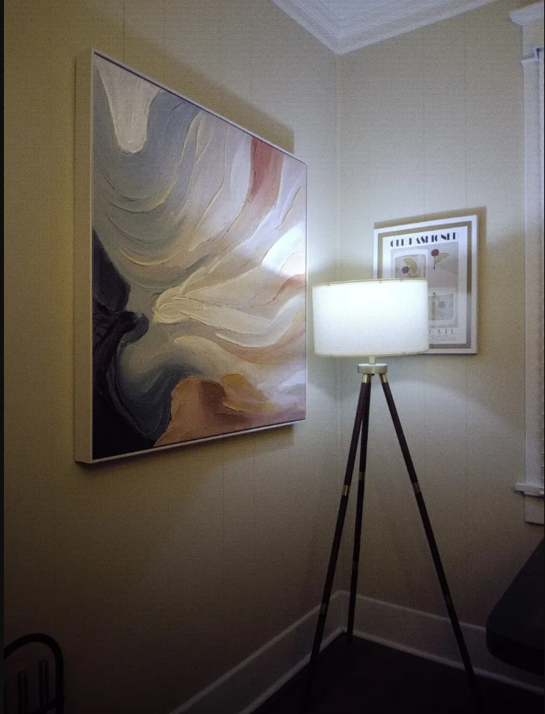

*Figure 1. The very first 50MP photo (a screenshot, so low resolution): rough, with visible grain throughout.*

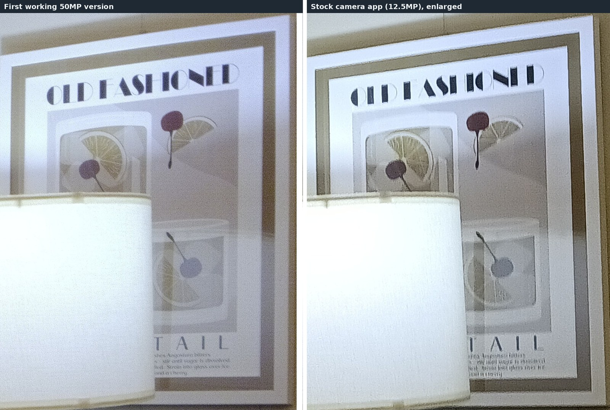

*Figure 2. The first working 50MP version (left) next to the stock camera app (right), same scene. The stock crop is enlarged to match. The 50MP photo is soft and grainy but resolves the poster's small print.*

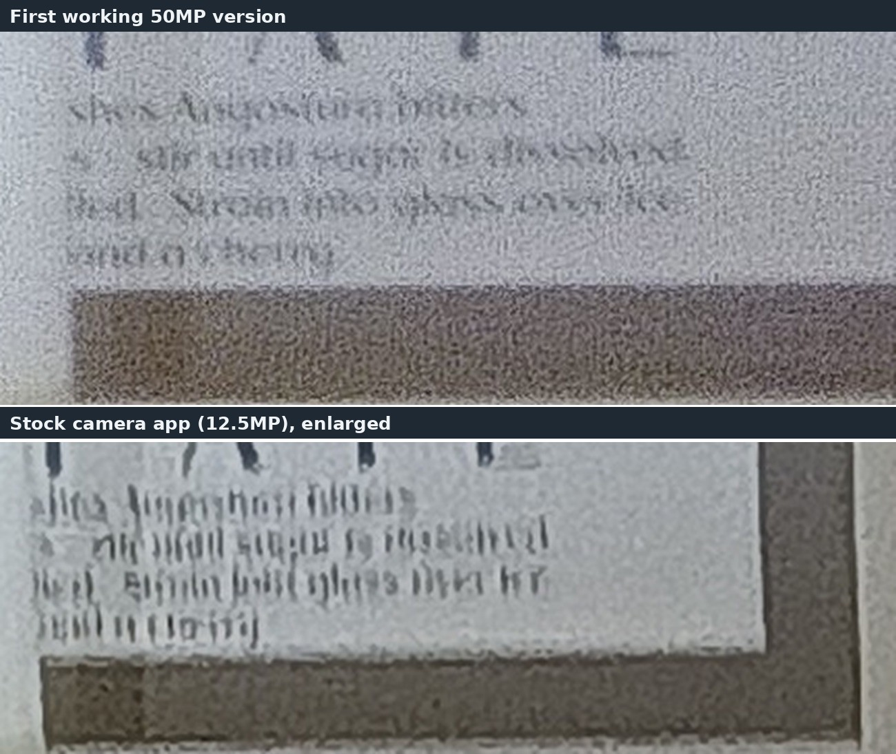

*Figure 3. A closer crop of the small print. At 50MP (top) the words can be made out through the grain. The stock app's version (bottom) turns them into vertical strokes.*

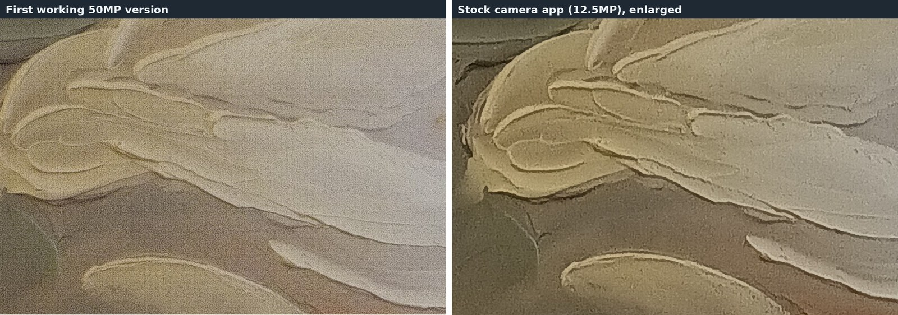

*Figure 4. The texture of a painting. The first 50MP version (left) is very grainy; the stock app's version (right) is smoother but looks painted over.*

## The journey in four steps

Each layer between the sensor and the JPEG had to be opened up in turn (figure 5).

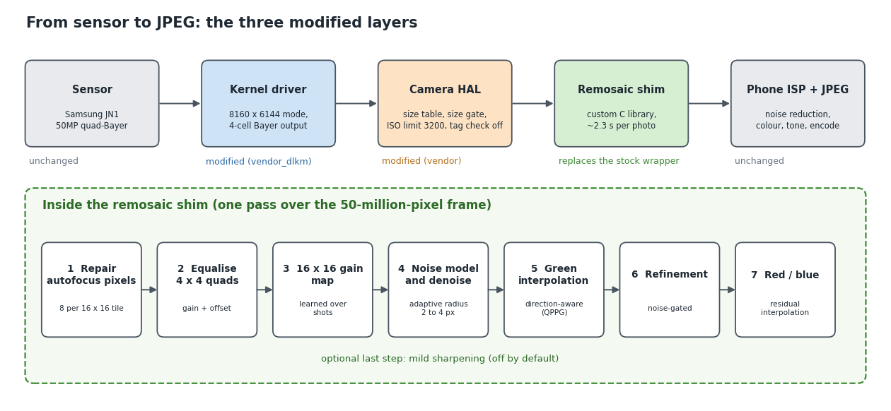

*Figure 5. The camera pipeline. Three layers were changed or added; the sensor and the phone's own image processing are untouched.*

1. **The driver.** An 8160 × 6144 mode was added to the sensor driver, using the register table from the Nothing Phone 2a's open-source JN1 driver (it matches 167 of 170 registers of the mainline Linux driver's full-resolution mode). The output is declared as 4-cell Bayer so the camera HAL switches to its 4-cell session. The module was rebuilt from the LineageOS kernel source for this chipset and checked against the stock module (all 117 symbol checksums match).
2. **The HAL.** The camera HAL never offered 50MP to apps and had several gates in the way. Three of its libraries were patched with tiny byte-level edits (about 60 bytes in total): the size table (the top size 4608 × 3456 became 8160 × 6144), an app vendor-tag check (removed), and the ISO limit (raised from 200 to 3200). A small piece of added code, the size gate, lets only requests wider than 4096 px use the 50MP path, so the stock camera app and normal-size photos behave as before.
3. **The remosaic.** A first bilinear version proved the idea. The current one uses direction-aware green interpolation, residual interpolation for red and blue, a noise-adaptive bilateral denoise and a noise-gated refinement step. A Python test bench with simulated sensor data scored it at 27.5 dB against 26.1 dB for the first version at ISO 800. It was ported to C and optimised from 13.8 s to about 2.3 s per photo, using all 8 cores.
4. **The dot lattice.** The hardest artefact to remove, described next.

## The dot lattice

Early 50MP photos showed a faint, perfectly regular grid of dots. It came from the sensor's phase-detection autofocus (PDAF) pixels. Eight of them sit at fixed positions in every 16 × 16 tile (figure 7). They respond like green pixels placed in red and blue slots, and the pixel next to each one in the same cell (its "cell-mate") is also affected. Stock phones remove this with factory calibration data, which this module doesn't have.

The dots are easy to see on a flat surface (figure 6). In the first working version they form a regular grid across the green panel; the stock app's photo of the same panel has none.

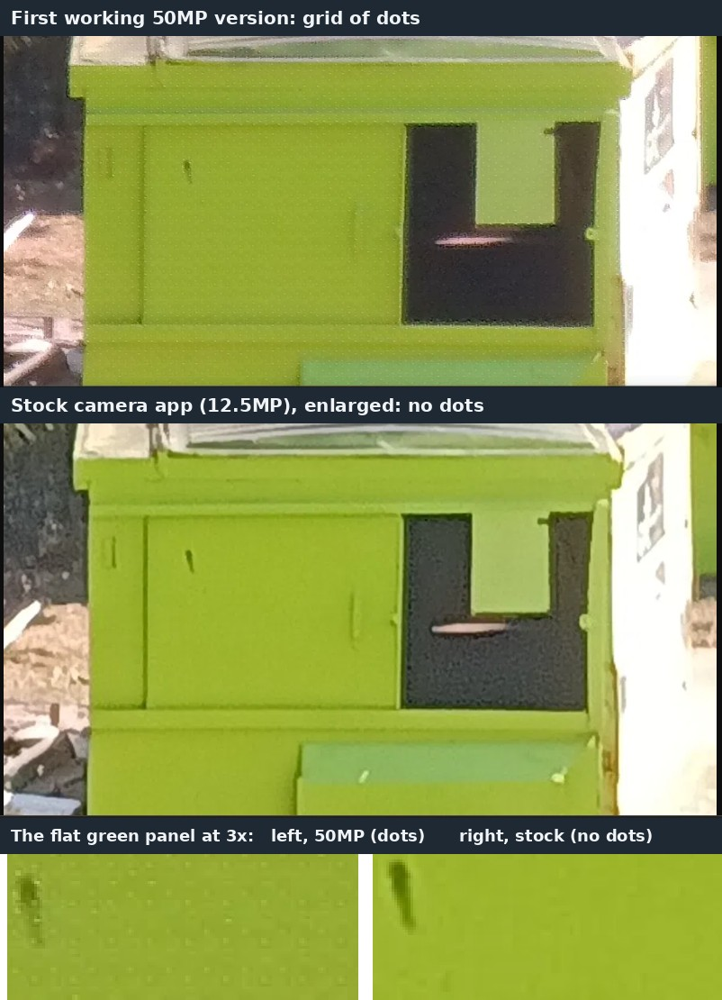

*Figure 6. The dot lattice in the first working version. Top: a green dumpster in daylight at 50MP. Middle: the stock camera app's photo of it, enlarged. Bottom: the flat green panel at 3×, where the grid of dots is easy to see on the left and absent on the right.*

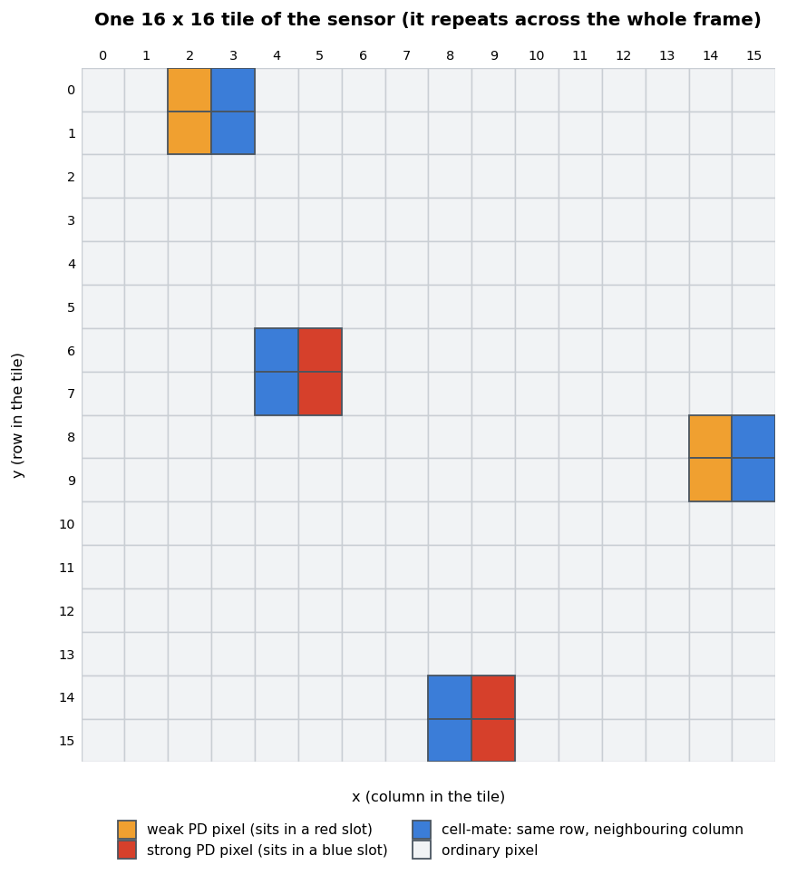

*Figure 7. One 16 × 16 tile. The tile repeats across the whole sensor, which is why the artefact looked like a regular grid.*

The fix has three parts, all inside the shim:

- **Repair the autofocus pixels** from nearby pixels of the right colour, with an edge-aware version near edges. This alone removed roughly 75–85 % of the dots.
- **Learn a 16 × 16 gain map** from flat areas over the first shots. It corrects what the repair misses at each of the 256 positions, brought the lattice down to the level of the binned background, and survives camera restarts.
- **Equalise the 2 × 2 quads**, which differ by about 1 % and also feed the pattern.

What is left is about 0.1–0.5 % depending on the scene's colour, and the lattice isn't visible by eye in any scene tested. Two ideas were tried and dropped: the sensor's own on-chip correction registers (they made it worse), and a per-frame colour correction of the cell-mates, which fixed the bias in flat tiles but gave mixed results in finished photos, so it is off by default.

For comparison, figure 8 shows the current version on flat areas of a different scene, at the same 1:1 magnification.

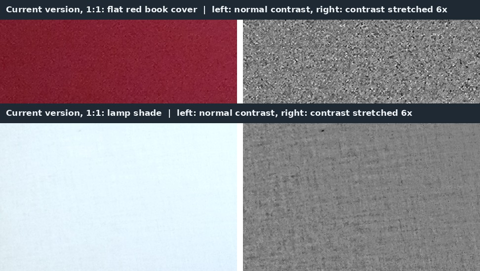

*Figure 8. The current version at 1:1: a flat red book cover (top) and a lamp shade (bottom). Left: normal contrast. Right: the same area with the contrast stretched 6×. There is noise, and the weave of the fabric, but no grid of dots. This is a different scene and lighting from the dumpster, so it is not a pixel-for-pixel comparison.*

## What the photos show

Every comparison uses the same scene, the phone on a tripod where possible, shots aligned to each other, and lossless crops. Numbers are medians over many text strokes and flat patches, with two shots per setting.

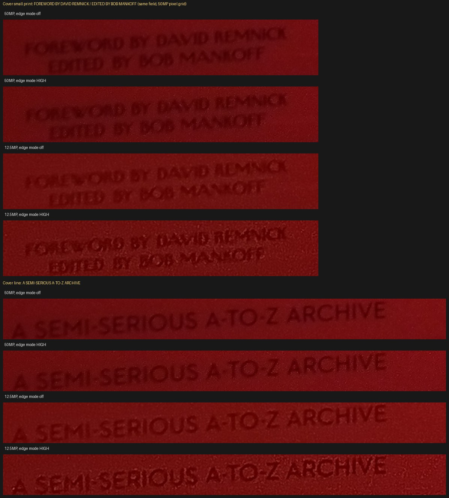

*Figure 9. Book cover small print, same field, 100 % crops (the 12.5MP shots are enlarged 2× to the 50MP grid). From the top: 50MP with edge mode off, 50MP with edge mode High, 12.5MP off, 12.5MP High. The 50MP shots are smoother and softer; the 12.5MP shots are crisper and grainier.*

- **Cleaner:** at the same viewing size the 50MP default has about half the noise of Open Camera's 12.5MP shot (roughly 5 against 9 on a flat red patch, and 1.5 against 6 on a dark table).
- **Softer:** its small-print contrast is roughly half. The camera's own edge enhancement is probably tuned for 12.5MP and does much less at 50MP. That reasoning is a hypothesis, not something that was tested.
- **Open Camera's "edge mode: high quality"** does reach the 50MP path and helps a little, at the cost of some grain.

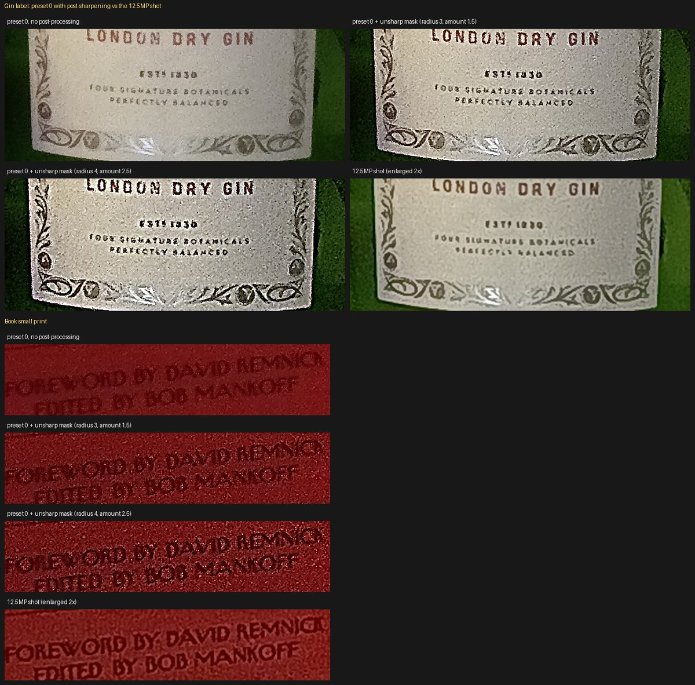

*Figure 10. The default 50MP file with and without a simple unsharp mask in post, next to the 12.5MP shot enlarged. After sharpening, the 50MP file shows finer lettering than the 12.5MP shot, at the cost of extra grain.*

So the detail is there; it just needs sharpening. Two shim settings were tried to get it without post-processing, and neither helped:

- Lowering the shim's denoise strength (1.0 and 0.5 instead of 2.0) doubled or tripled the grain with no measurable extra detail.
- The shim's own mild sharpening, at several strengths and radii, changed very little, so it is off by default.

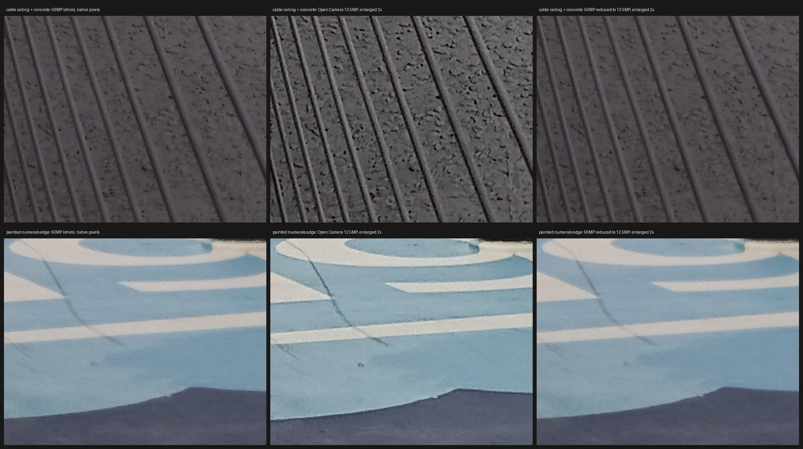

*Figure 11. The honest case: a handheld dusk scene (cable railing and concrete on top, painted numerals below). Left to right: 50MP, Open Camera 12.5MP enlarged, and the 50MP shot reduced to 12.5MP. In dim light the 12.5MP shot is visibly crisper. The 50MP shot had 1.4–2× the fine-detail signal near the 12.5MP limit, but a 2–4× lower signal-to-noise ratio.*

## Limits and rough edges

- **Speed:** about 2.3 s per photo (about 3 s while calibrating over the first ~8 shots), and the camera HAL adds a few seconds on top.
- **When the 50MP path doesn't run:** manual ISO or shutter modes skip it, and above ISO 3200 (dim scenes) the camera falls back to its normal processing. That output is probably an upscaled 12.5MP frame in a 50MP-sized file, which fits one test but isn't confirmed.
- **Files** are 12–13 MB JPEGs. Open Camera was used for testing; it has no RAW.
- **Tested** on one phone with firmware 0120.
- **Requires** an unlocked bootloader, modified vendor and vendor_dlkm partitions, and verified boot disabled. That is a real risk to the phone: back up first, and keep the stock images for undo.

## Where it's useful

- **Cropping:** crop to a quarter of the frame and still have a 12.5MP image. A 12.5MP shot cropped the same way gives about 3MP.
- **Well-lit, detailed scenes** on a tripod.
- **Sharpen in post** (an unsharp mask with a radius around 3 px at 50MP), or try the camera app's edge mode "high quality".
- For snapshots in dim light, the normal 12.5MP mode is the better choice.

## Credits and disclaimer

Built on the LineageOS kernel tree for this chipset (android_kernel_xelex_mt6789), the open-source JN1 driver from the Nothing Phone 2a (register table), and the mainline Linux s5kjn1 driver (cross-check), plus Zinwa's official firmware and flash tool. The analysis, code and this write-up were developed with AI assistance (Claude), with an outside second-opinion review of the PDAF analysis.

This is an unofficial hobby project and is not affiliated with Zinwa, Samsung, MediaTek or Nothing. It modifies system partitions; use it at your own risk.
